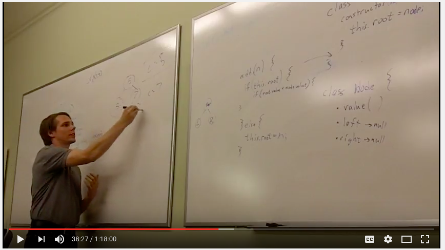

# Binary Search Trees

This repo will provide information about the binary search tree data structure as well as exercises to apply algorithms to retrieve meaningful information from the trees.

A data structure is a particular way of organizing data in a computer to utilize resources efficiently. 

We create and use "data structres" to organize data in our computer in a way that will allow us to utilize that data efficiently and effectively.

------------------------------------------------------------------------------------------------------

Click on this image to view a video of a talk I gave on BSTs and their application in this project I'm working on:

